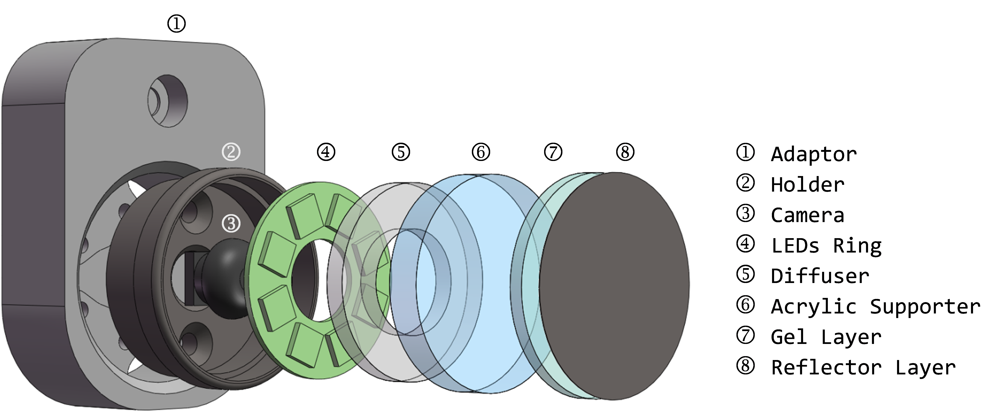

# MC-Tac
> Open Source of Modular Camera-based Tactile Sensor for Robot Gripper

</br>
</br>

## Overview
We proposed a modular camera-based tactile sensor for robot gripper, which facilitates fabrication and integration process of tactile sensors for various robot grippers and fingers.</br>
This paper was first publised on [ICIRA2023](https://icira2023.org/index.html).


</br>
</br>

## Hardware
Proposed tactile sensor is consist with adaptive connector for various gripper, as well as commerial and purchasable elements (silicon gel, acrylic, LED ring board, micro-camera module). This design balances the performance, adaptability, and the fabricated convenience of propused sensor. The 3D print `.stl` files are stored in the hardware folder.<br>
- `HolderSlimW` is the connector;</br>
- `Supportor` is the receptor which supports camera, LED, acrylic, gel;</br>
- `Diffusor` is the subdued light board for uniform illumination;</br>
- `Acrylic` is the acrylic board (can be cut by Laser cutting machine);</br>
- `GelModeA` can pouring the gel layer with acrylic board directly.;</br>
- `GelModeB` can pouring the large layer of gel, then cutting by laser cutting machine, painting reflect layer, and be sticked on acrylic piece.</br></br>

## Acknowledge
This work is strong inspired by [GelSlim](https://github.com/mcubelab/gelslim) and [GelSight](http://gelsight.csail.mit.edu/wedge/) et al.</br>
If this work inspires your research, please cite BibTeX:<br>
```
@inproceedings{Ren2023MC-Tac,
  title={MC-{T}ac: Modular Camera-based Tactile Sensor for Robot Gripper},
  author={Ren, Jieji and Zou, Jiang and Gu, Guoying},
  booktitle={The 16th International Conference on Intelligent Robotics and Applications (ICIRA2023)},
  year={2023},
  organization={Springer}
}
```

